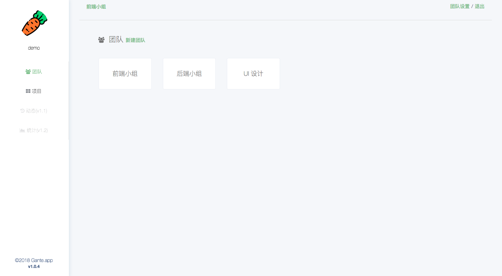
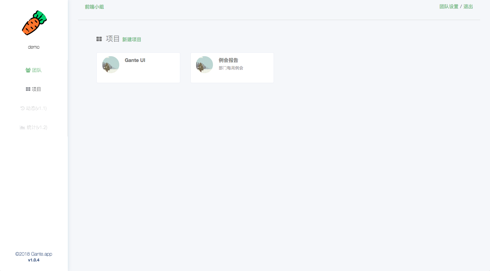
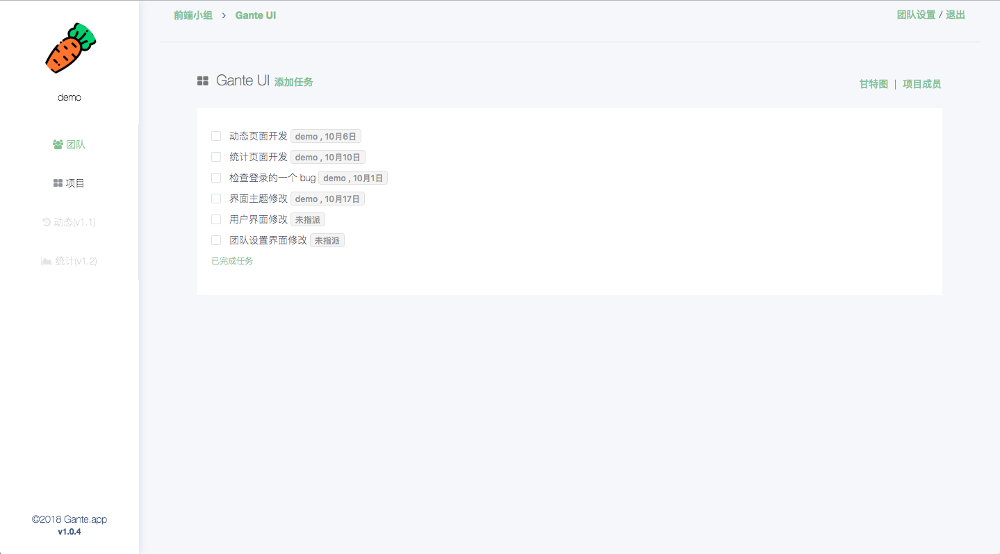
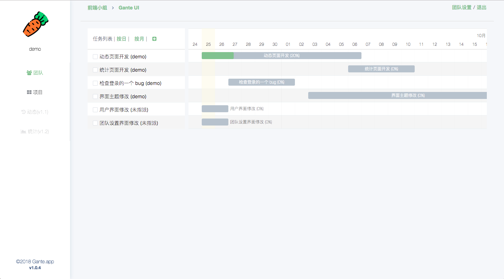
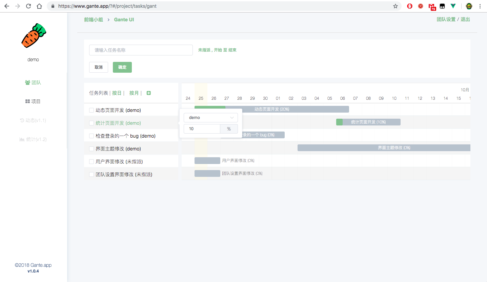
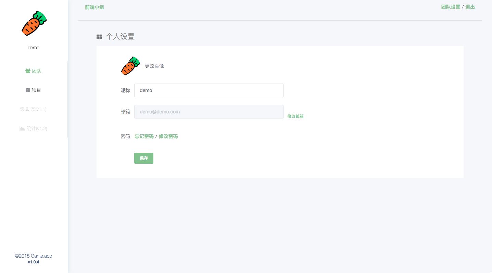

# Gante - 甘特图任务管理器

适合新手入门学习的完整 vue 案例。

## 前言
之前跟朋友一起写了一个简单的任务管理器，带有甘特图的功能。开源的目的是因为现在 Vue 比较完整的开源案例比较少。开源出去供大家一起学习。

这是一个前后端彻底分离的项目，前端和后端具有不同的域名（主域名相同），当然，你也可以把它和后端目录放在一起。

我于今年 4 月才开始接触 Vue，以前折腾过 React 和 React Native，用 React Native 开发过一个 App 并上架。

该项目原仓库是在 Gitlab 上面，比较喜欢 Gitlab 自带的 CI/CD 功能，所以个人平时使用 Gitlab 比较多，迁移到 Github 上面进行开源，删除了接口的一些敏感信息。项目目前是 1.x 版本，还是有一些 bug 和很多不那么好的地方。

## 使用和使用

克隆到本地
```
git clone git@github.com:fengzifz/GantTask.git
```

安装 package
```
npm install
```

开发模式运行
```
npm run dev
```

**为部分接口添加了测试数据，现在可以直接运行查看效果，后续会覆盖全部接口**

## 在线案例
- 地址：https://www.gante.app
- 用户：demo@demo.com
- 密码：123456

##  前端技术栈
- Vue 2.0
- Element-ui
- Vuex
- axios
- frappe-gantt
- quill-editor
- ECMAScript 6

## 代码风格
本项目遵循 ESLint 代码风格

## 测试
本项目暂时没写单元测试

## 项目信息
项目共有 18 个页面，主要的功能有如下：

- 团队管理
    - 添加、编辑、删除团队
    - 团队成员管理：邀请、删除
- 用户管理
    - 注册、登录
    - 基本个人信息
- 项目管理
    - 添加、编辑、删除项目
    - 项目成员管理
- 任务管理
    - 添加、编辑、删除任务
    - 指派任务
    - 任务甘特图

目录结构不再多说，项目是使用 vue-cli 构建，并且具备热重载和保存时 lint 校验，更多相关信息请查阅官方文档：[Vue.js - 命令行工具](https://cn.vuejs.org/v2/guide/installation.html)。

## 贡献者
- [zijianchen](https://github.com/zijianchen)

从 gitlab 拷贝过来时，我并没有保留 .git 文件，所以所有的历史提交记录都不会在这里出现。

## 项目截图








## License

Released under the [MIT License](https://github.com/fengzifz/GantTask/blob/master/LICENSE)
